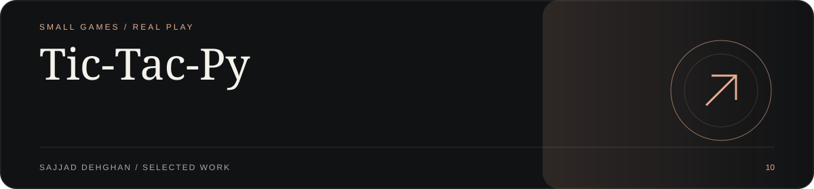
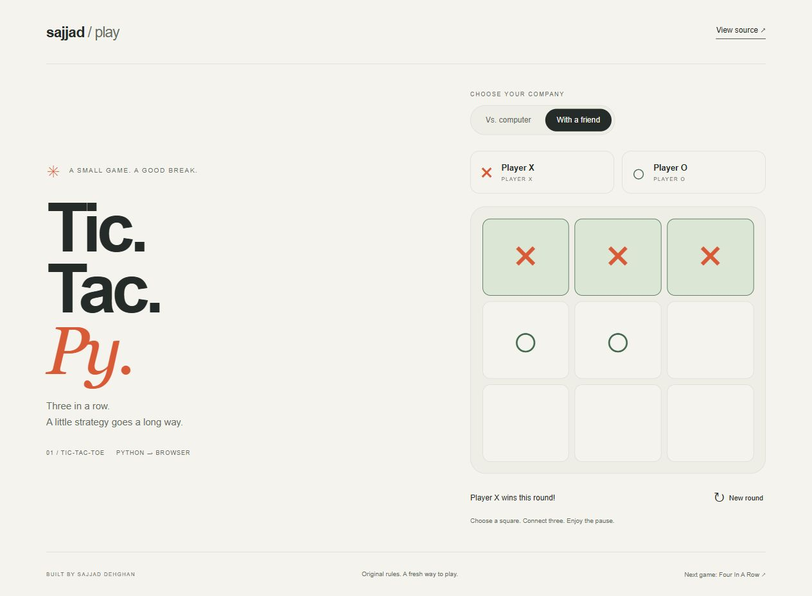
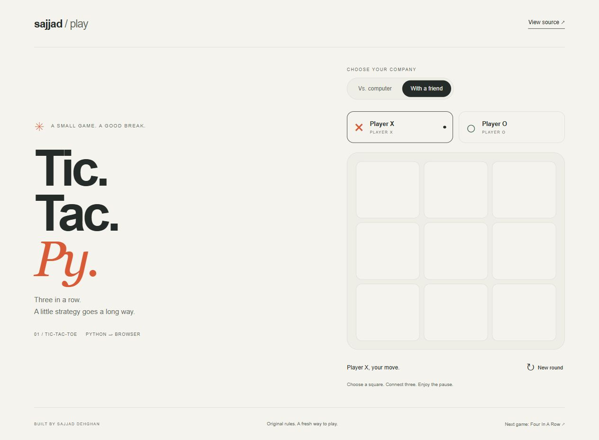

<!-- visual-showroom:start -->
<p align="center">
  
</p>

<p align="center">
  <strong>Tic-Tac-Py</strong><br>
  SMALL GAMES / REAL PLAY
</p>

<p align="center">
  <a href="https://sajjad-dehghan-personal-site.prisoner-sedwna.workers.dev/projects/tic-tac-py"><strong>Explore the showroom ↗</strong></a> ·
  <a href="https://sajjad-dehghan-personal-site.prisoner-sedwna.workers.dev/play/tic-tac-py/"><strong>Try the browser edition ↗</strong></a> ·
  <a href="#implementation--original-documentation">Setup &amp; implementation ↓</a>
</p>

Terminal tic-tac-toe in Python. Play a friend, or a computer that wins when it can, blocks you when it has to, and otherwise takes the best square.

## Visual tour

[](https://sajjad-dehghan-personal-site.prisoner-sedwna.workers.dev/projects/tic-tac-py)

<p align="center">
  <a href="https://sajjad-dehghan-personal-site.prisoner-sedwna.workers.dev/projects/tic-tac-py"></a>
  <a href="https://sajjad-dehghan-personal-site.prisoner-sedwna.workers.dev/projects/tic-tac-py"></a>
</p>

1. Actual new browser edition · JavaScript port of the original Python rules
2. Two-player mode selection
3. Actual round completion and winner

Real captures or owner-supplied images, not generated product mockups. Demo/local data and edition boundaries are documented below.

## Implementation & original documentation

The existing run instructions, architecture, limitations and credits are preserved below.

---
<!-- visual-showroom:end -->

# Tic-Tac-Py

## Browser gameplay gallery




Actual browser edition captures, 2026-10-07; a JavaScript port, not a live Python backend. [Showroom](https://sajjad-dehghan-personal-site.prisoner-sedwna.workers.dev/projects/tic-tac-py).

A terminal Tic-Tac-Toe game in Python. Play against a friend or against a rule-based computer opponent.

## New browser edition

A minimal, playable browser frontend is included in `web/`. It supports the original two-player and rule-based computer modes, win/draw detection and starting another round. The JavaScript engine follows the Python game's exact move priority: win, block, corners, center, edges. This is a browser port, not a Python server; `src/main.py` is unchanged.

[Play the browser edition](https://sajjad-dehghan-personal-site.prisoner-sedwna.workers.dev/play/tic-tac-py/)


To run the frontend locally with Python 3 (no extra packages):

```bash
python -m http.server 8080 --directory web
```

Open `http://localhost:8080/`. Use Tab and Enter/Space to play with a keyboard. The image above is a screenshot of actual gameplay, not an illustration. The original terminal instructions follow.

## Features

- **Two modes:** Player vs. Player, and Player vs. Computer.
- **Rule-based computer opponent.** On each turn the computer:
  1. takes a winning move if it has one,
  2. otherwise blocks a move that would let you win,
  3. otherwise picks the first free cell in this order: corners, then the center, then the edges.
- **Colored board** using `termcolor`: `X` is red and `O` is blue.
- **Automatic win and draw detection** across all rows, columns and diagonals.

## Requirements

- Python 3
- [`termcolor`](https://pypi.org/project/termcolor/)
- Windows. The game clears the screen with the `cls` command. On Linux or macOS, change the `os.system('cls')` calls to `os.system('clear')`.

## Getting Started

```bash
git clone https://github.com/sedwna/Tic-Tac-Py.git
cd Tic-Tac-Py
pip install termcolor
python src/main.py
```

## How to Play

Pick an option from the main menu:

```
1.Start with friend
2.Start with computer
3.exit
```

The board cells are numbered 1 to 9. To place your mark, type the number of a free cell:

```
[1] [2] [3]

[4] [5] [6]

[7] [8] [9]
```

- In **Player vs. Player** mode, Player 1 is `X` and Player 2 is `O`.
- In **Player vs. Computer** mode, you are `X` and move first. The computer is `O`.
- You win by getting three of your marks in a row, column or diagonal. If all nine cells fill up with no winner, the game prints `Equal.` (a draw).

## Project Structure

```
Tic-Tac-Py/
├── src/
│   └── main.py   # Game logic, computer opponent and menu
└── README.md
```

Main functions in `src/main.py`:

| Function | Purpose |
| --- | --- |
| `menu()` | Shows the main menu and starts the selected mode |
| `start_duel()` | Runs a Player vs. Player game |
| `start_AI()` | Runs a Player vs. Computer game |
| `plyer_move(num, shape)` | Reads and validates a player's move |
| `computer_move()` | Chooses the computer's move (win, block, then corner/center/edge) |
| `check_board(plyr)` | Checks whether a player has three in a row |
| `print_board()` | Clears the screen and draws the colored board |

## Tech Stack

- Python 3
- `termcolor` for colored terminal output
